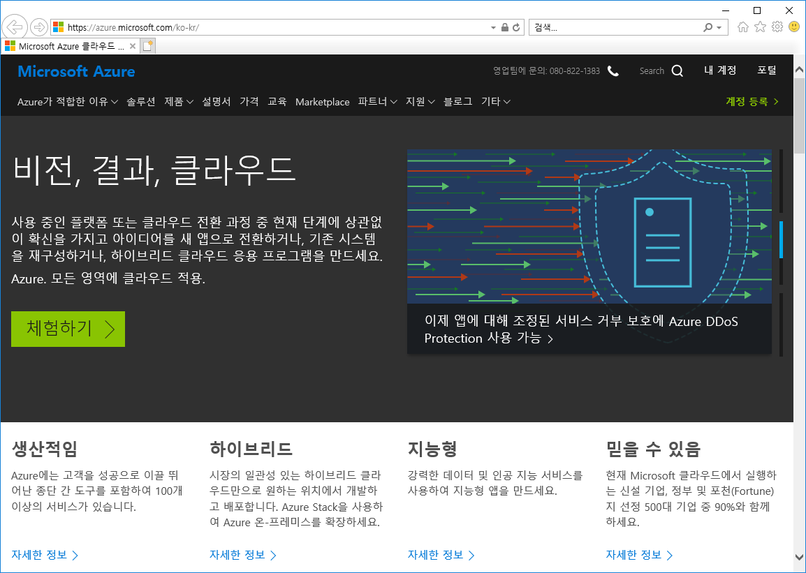
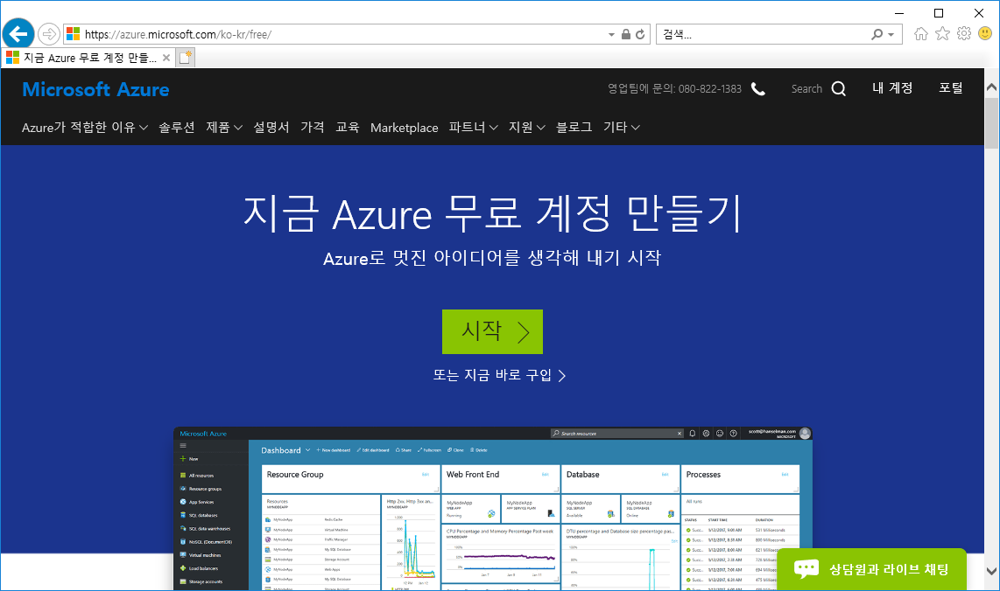
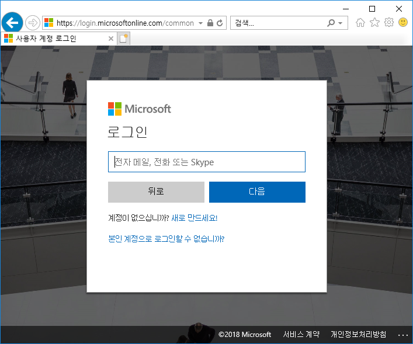
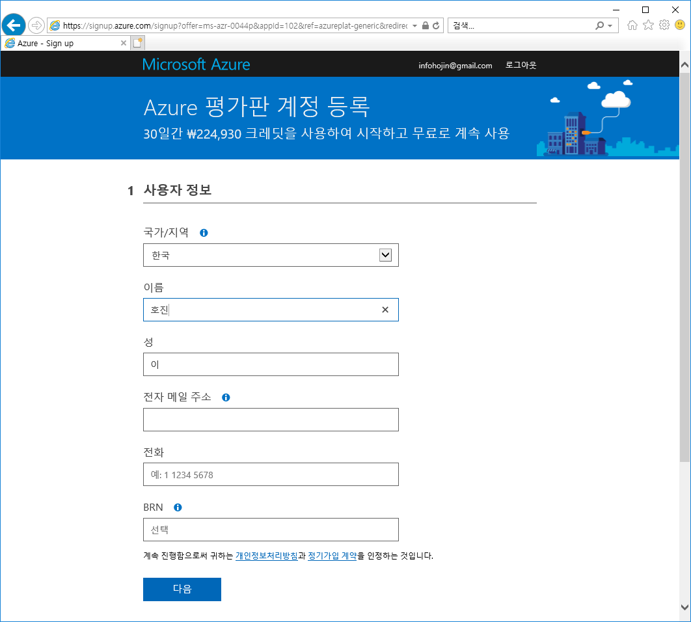
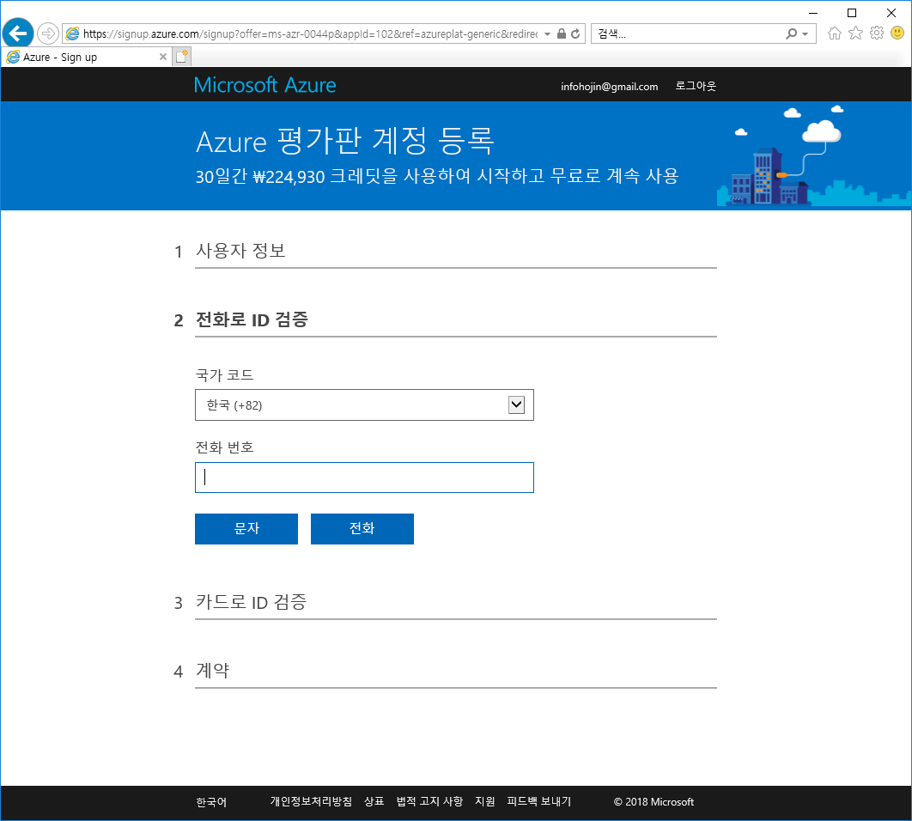
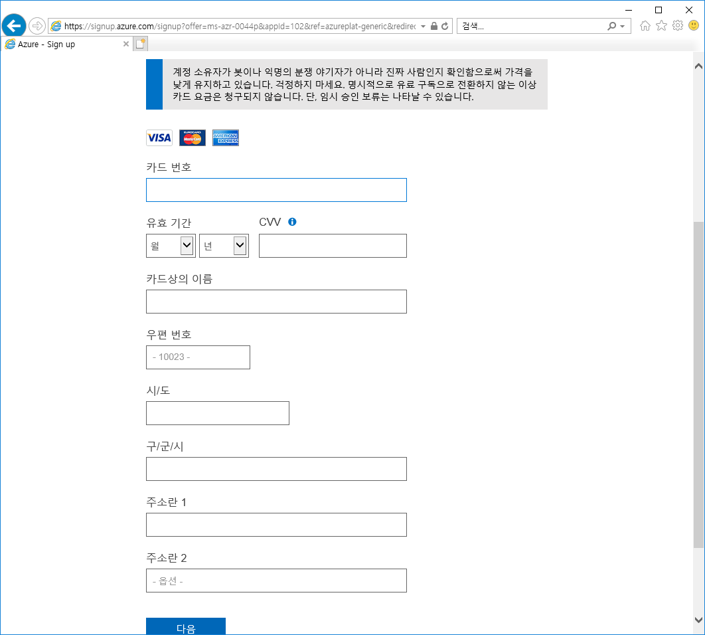
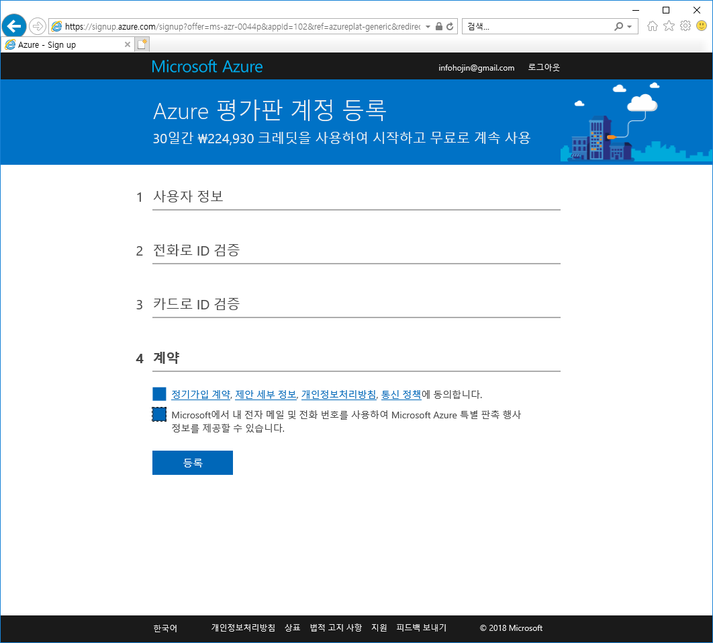
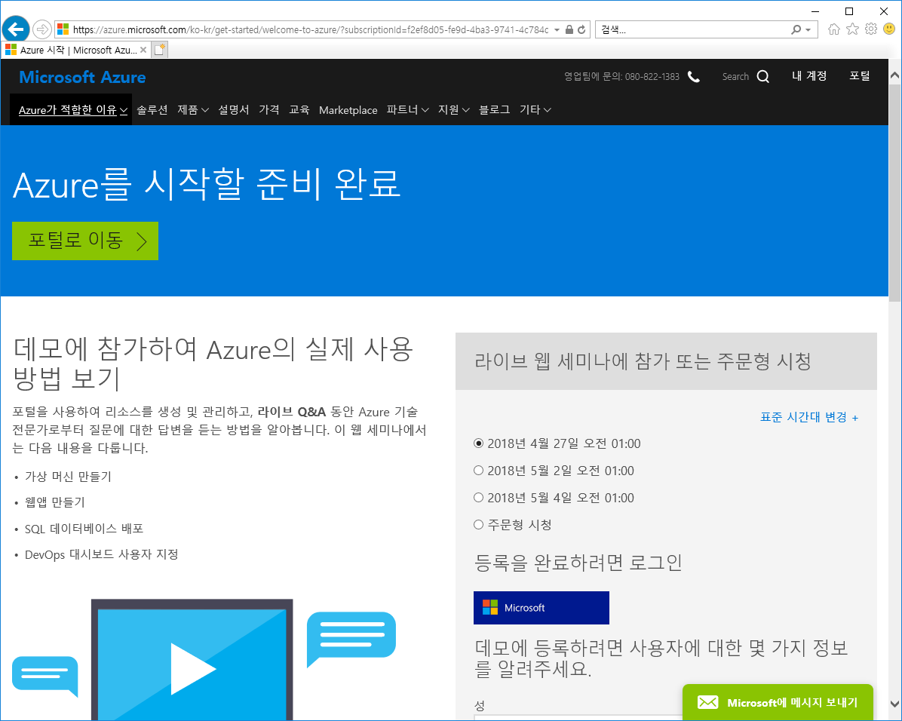
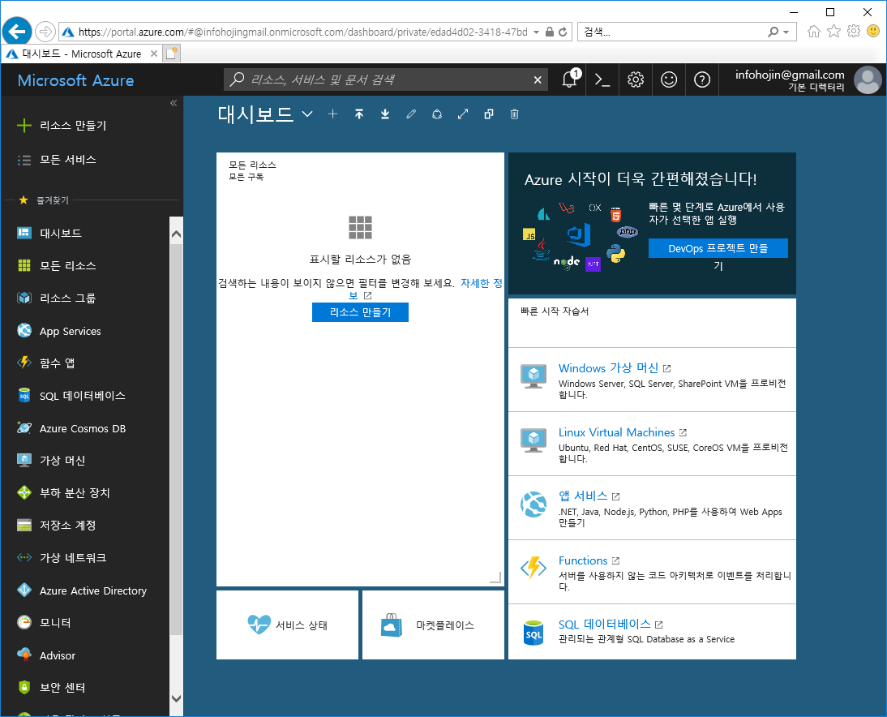

# Azure 가입하기

Azure는 간단한 회원가입을 통하여 쉽게 가입을 할 수 있습니다.

먼저 마이크로소프트 Azure 사이트(https://azure.microsoft.com/ko-kr) 로 접속을 합니다. 

사이트에서 `체험하기`를 선택합니다. 체험하기는 첫달 무료로 한달간 사용할 수 있는 혜택을 제공합니다.

에저를 사용하기 위해서는 먼저 마이크로소프트 회원에 가입이 되어 있어야 합니다.

회원 계정이 없으면, 새롭게 회원 계정을 생성하면 됩니다.

애저 회원을 가입할때 신용카드 정보와 본인인증을 같이 해야 합니다. 처음에 신용카드는 실제적인 고객을 확인하기 위해서 필요한 과정입니다.
신용카드를 등록을 하였다고 해서 결제가 되지는 않습니다. 또한, 무료 사용기간이 끝나도 자동결제 연장이 되지 않기 때문에 안심하시고 가입을 하셔도 됩니다.

평가판 계정등록

전화 ID검증
 
카드로 ID검증

계약동의

가입완료

애저포털
가입이 완료가 되면 애저포털 사이트에 접속을 할 수 있습니다.

 

 

